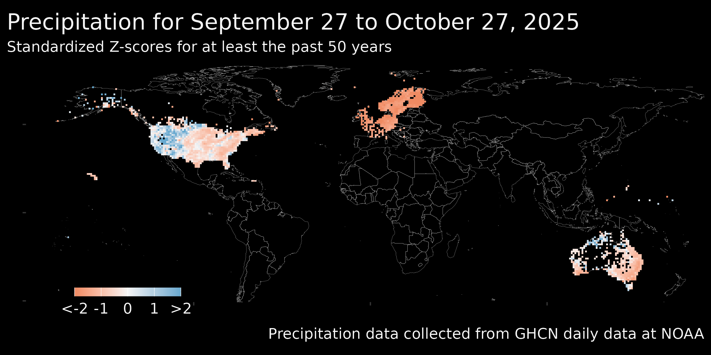

```{r echo = FALSE, message = FALSE}
library(lubridate)
```

```{css echo = FALSE}
.author, .title{
    display: none
}

.main-container {
    max-width: 100%;
}

body {
    background-color: black;
    color: #f5f5f5;
    font-size: 1.2vw;
}
```



Last updated on `r today()`    
This site was [created](`r rmarkdown::metadata$github_repo`) by Jackson Kent with instruction from Pat Schloss. All of the work in putting this pipleline together is owed to Pat and his Youtube channel, "Riffomonas."